# Session 10: Kubernetes Deployments

## Rolling Updates

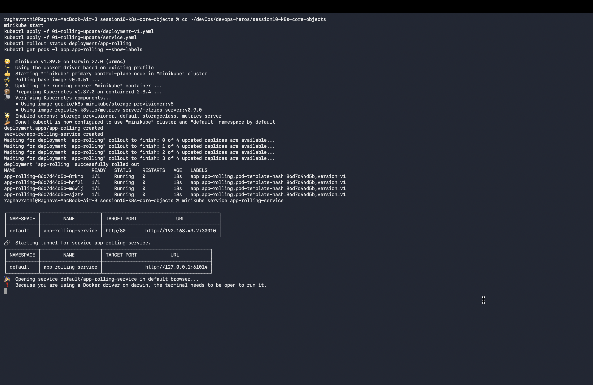

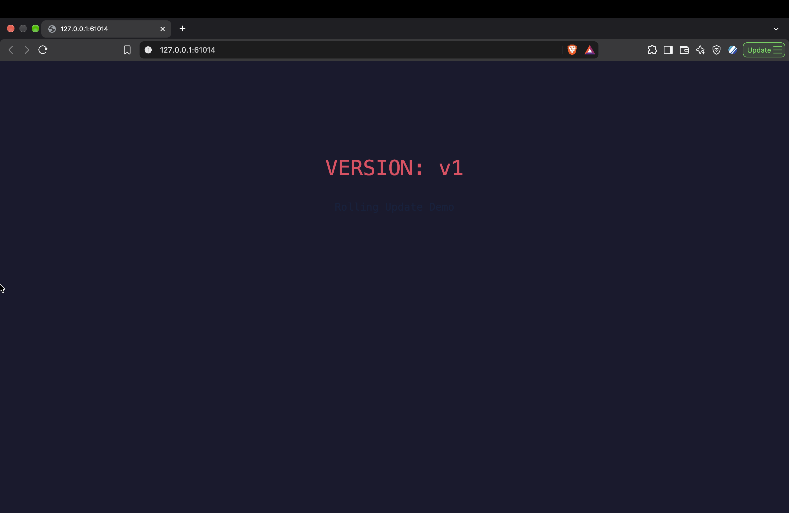

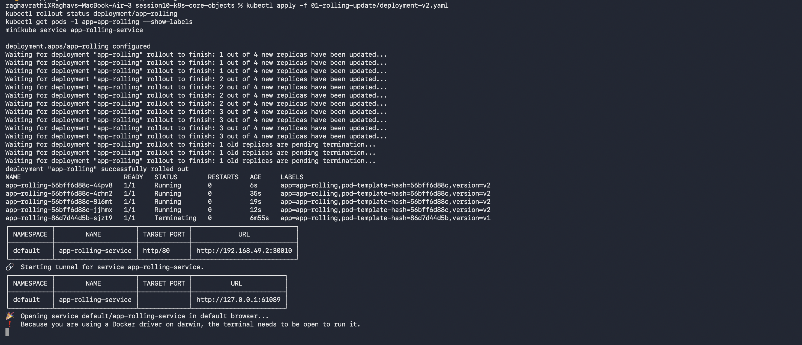

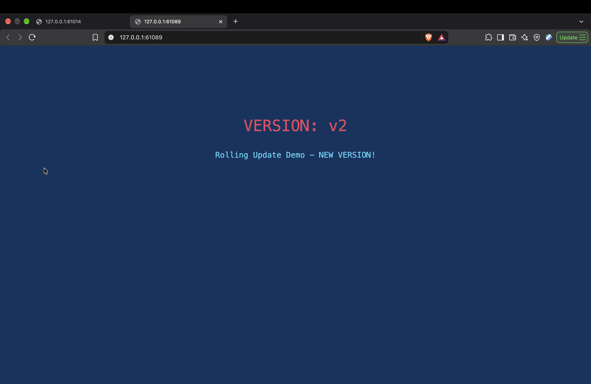

---

## Blue-Green Environments

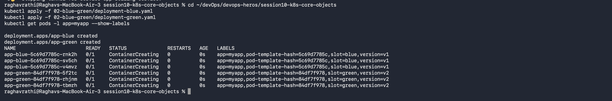

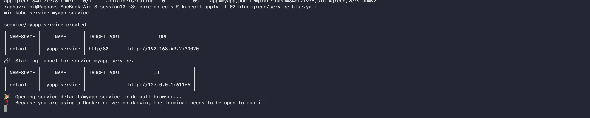

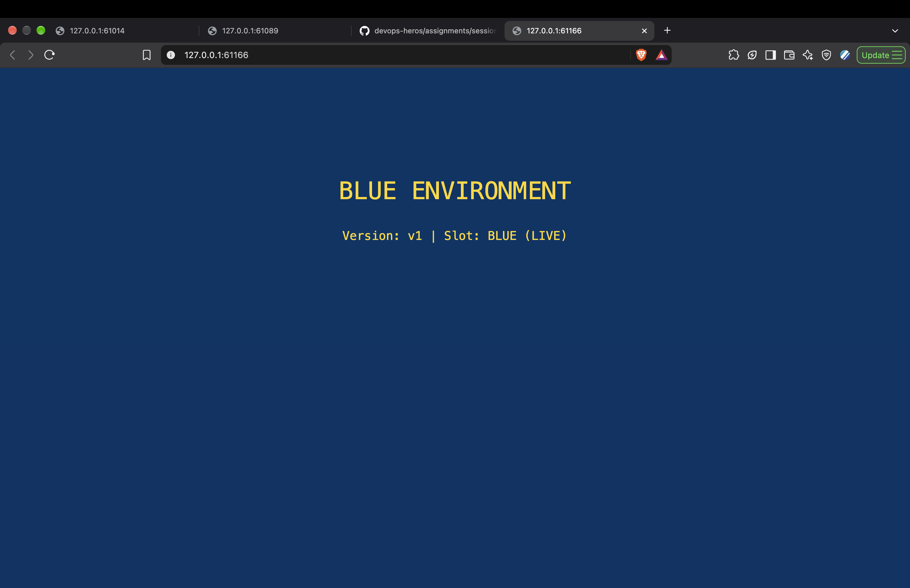

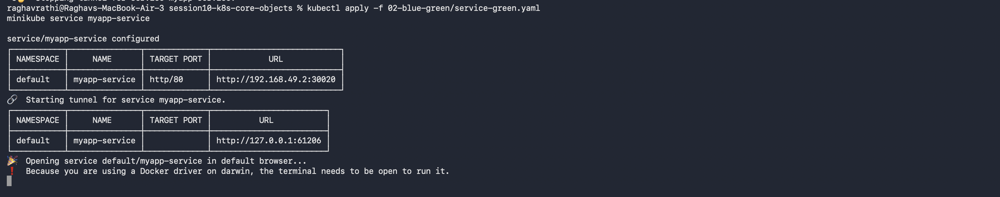

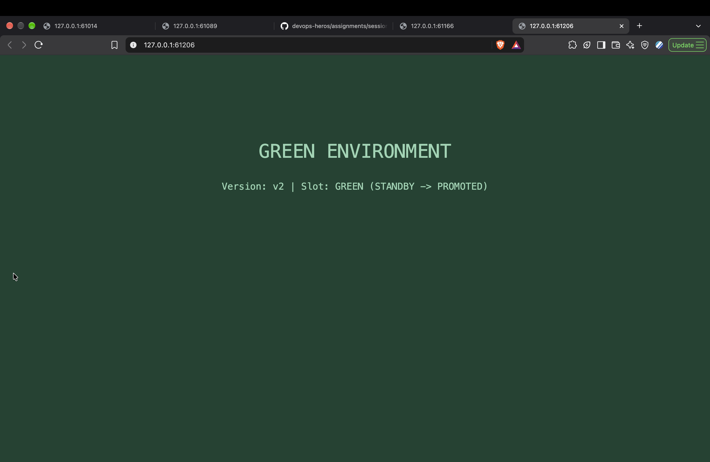

---

## Canary Deployments

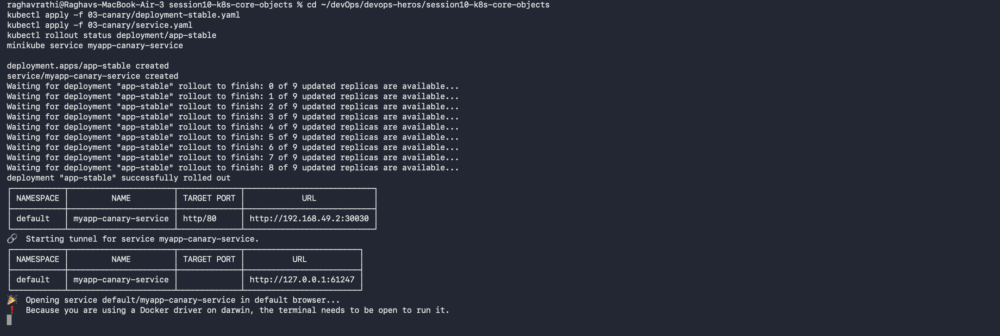

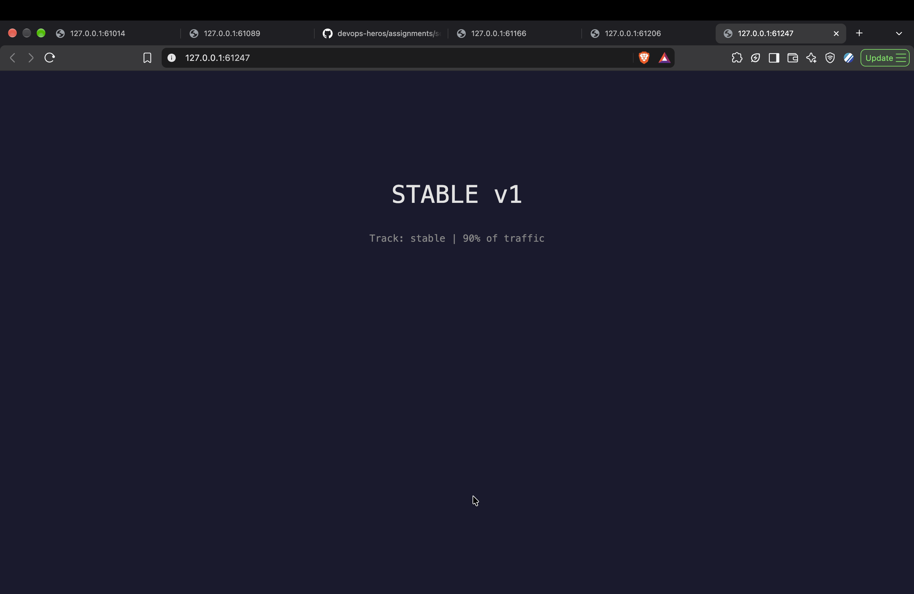

---

## Recreate Deployments

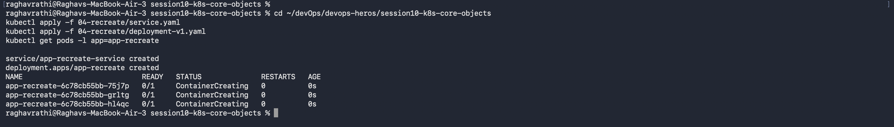

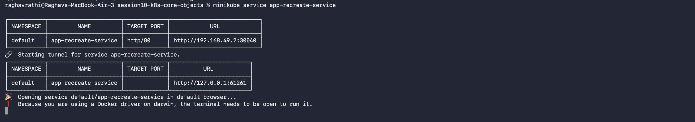

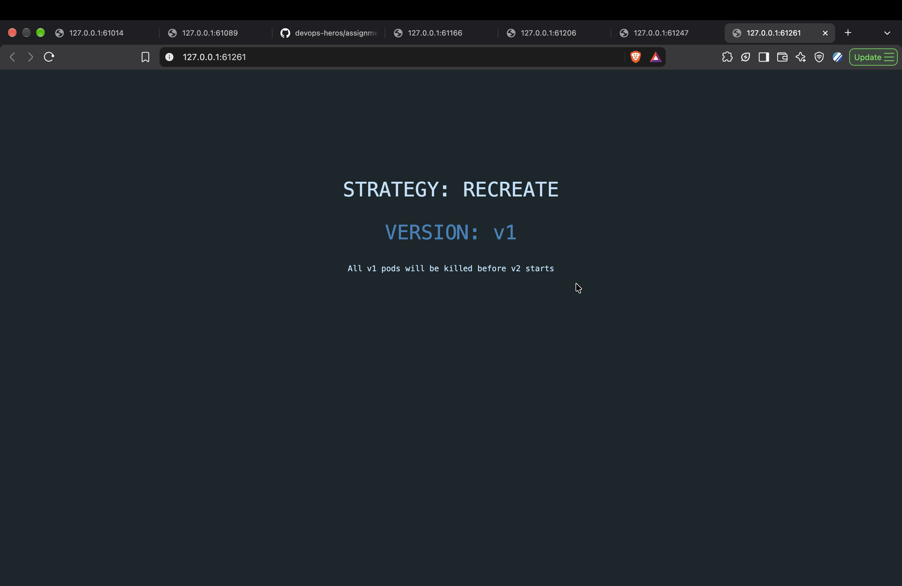

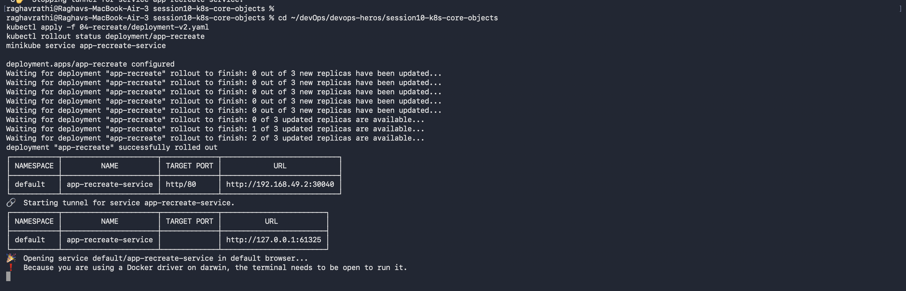

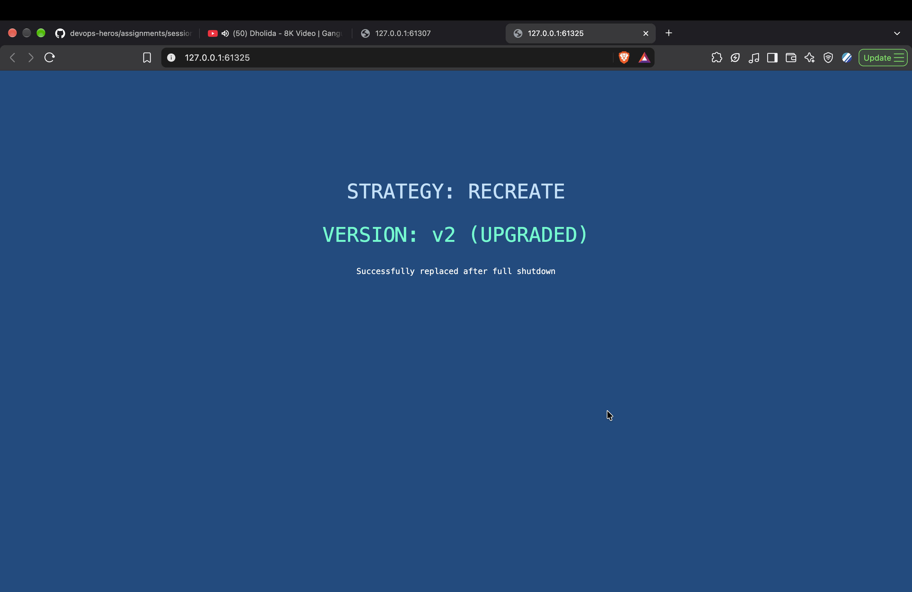

---

## Rollback Demonstration

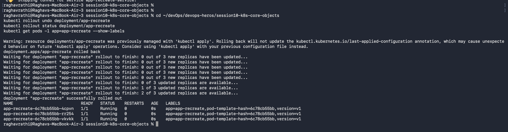
