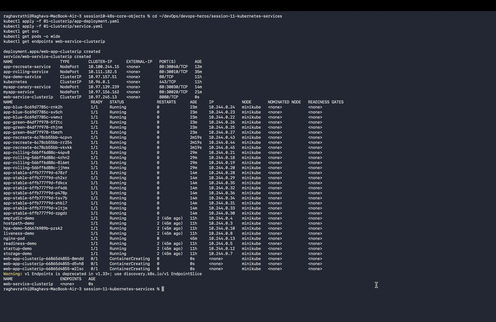
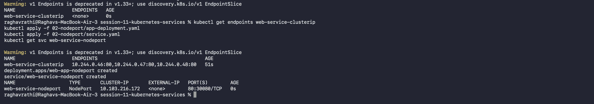
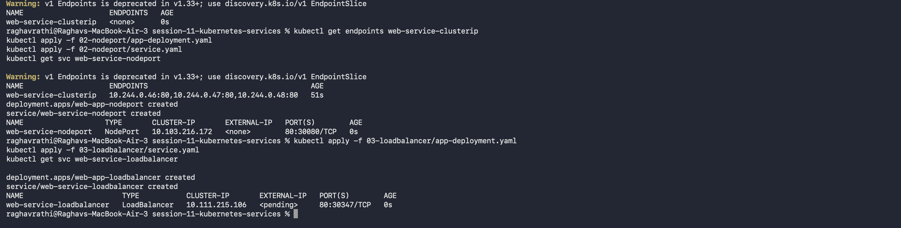
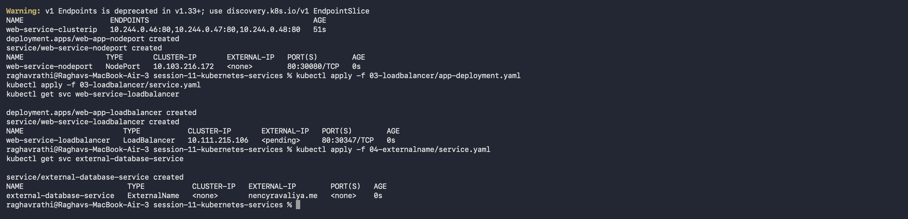
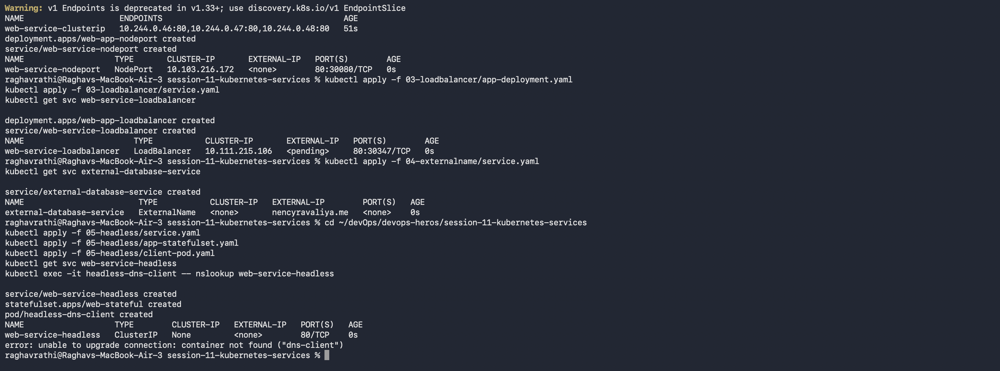

# Session 11: Kubernetes Services

## All Services and Pods Overview

---

## 1. ClusterIP Service & Endpoints

ClusterIP is the default Kubernetes Service type. It provides a stable virtual IP and DNS name reachable from inside the cluster.

---

## 2. LoadBalancer Service

LoadBalancer exposes the Service externally using a cloud provider's load balancer or local tunnel.

---

## 3. ExternalName Service

ExternalName maps a Service to an external DNS name (CNAME record).

---

## 4. Headless Service

Headless Service (`clusterIP: None`) provides direct DNS resolution to individual Pod IPs without assigning a virtual IP.

