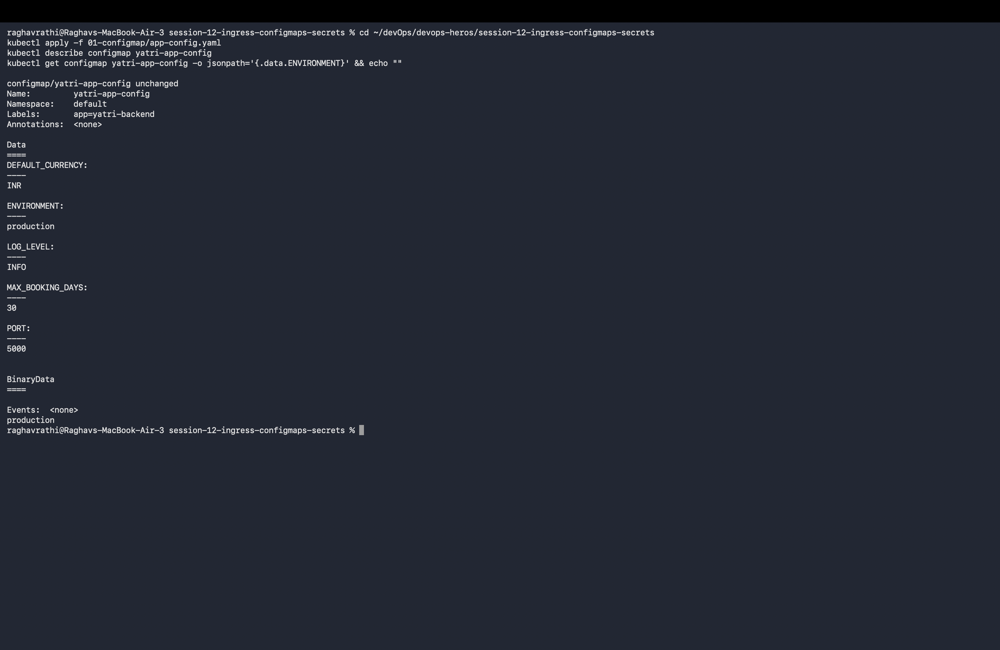
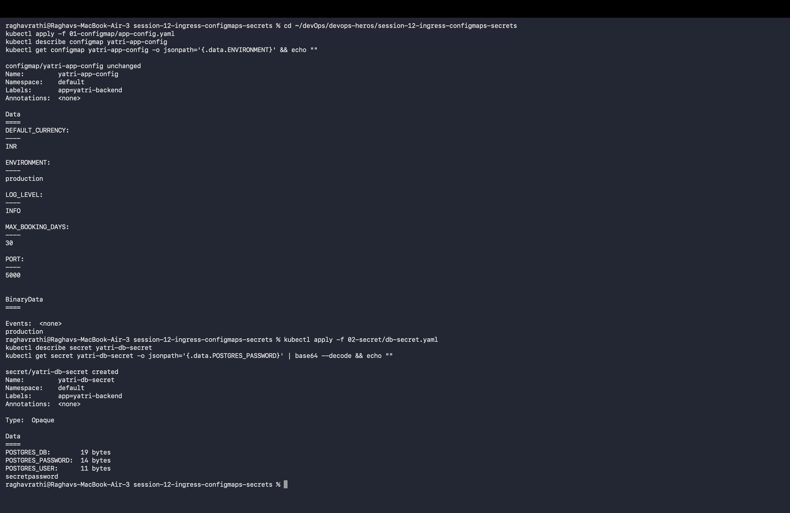
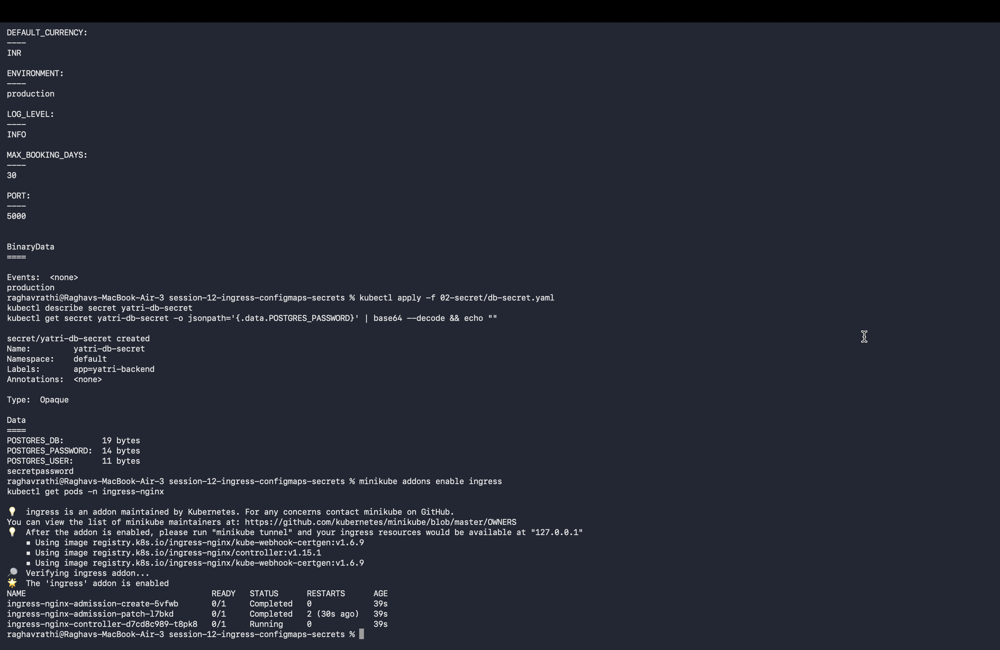
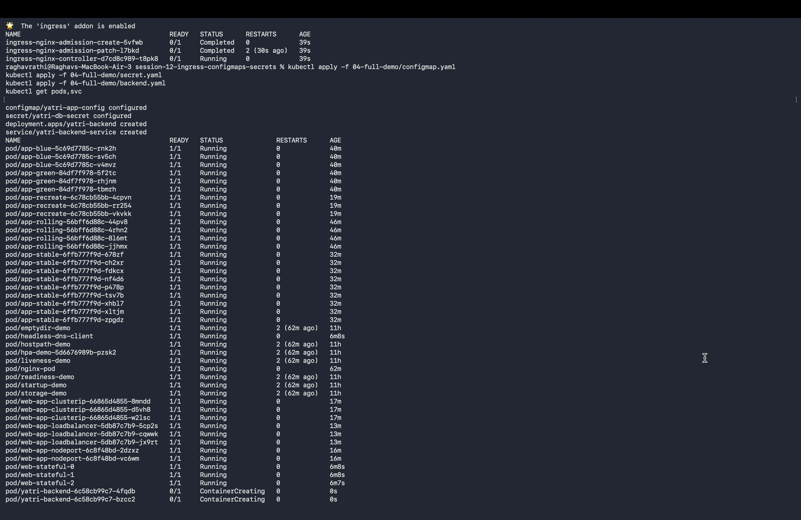

# Session 12: Kubernetes Ingress, ConfigMaps & Secrets

## ConfigMaps

ConfigMaps allow decoupling environment-specific configuration from container images.

---

## Secrets & Base64 Mechanics

Secrets isolate sensitive credentials such as database passwords and API tokens.

---

## Ingress Controller & Local DNS Activation

Enabling NGINX Ingress Controller addon on Minikube and checking system readiness.

---

## Full Microservice Application Demo

Complete multi-tier deployment integrating ConfigMaps, Secrets, Deployments, Services, and Ingress routing.

