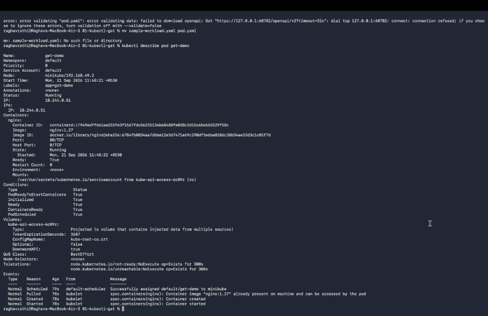
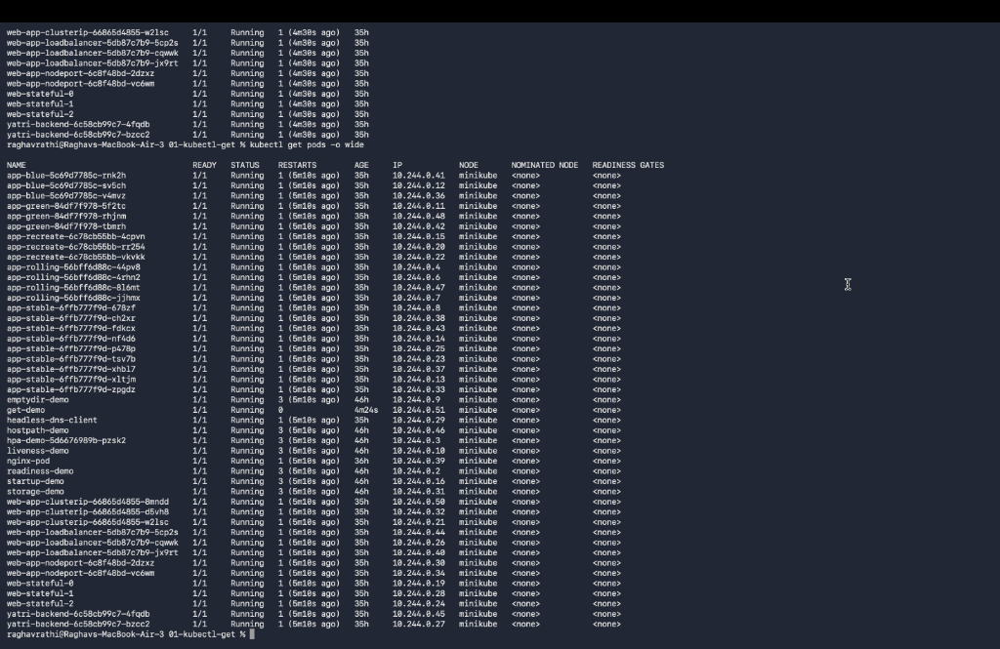
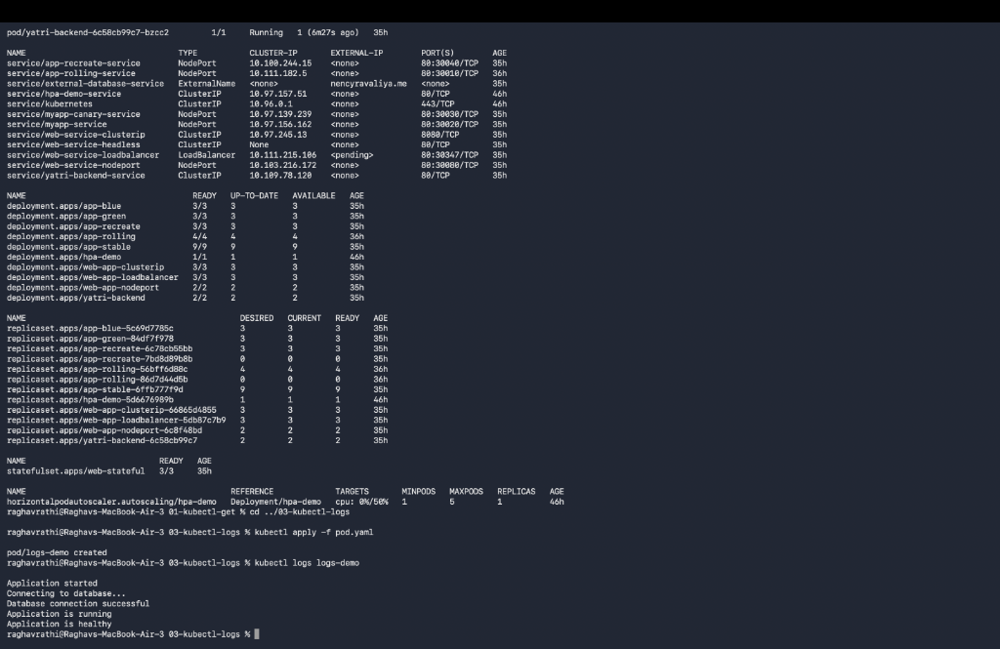
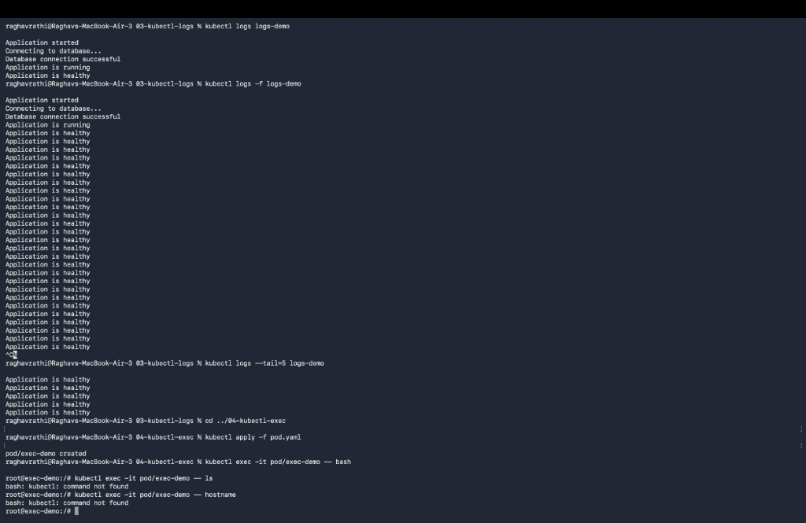
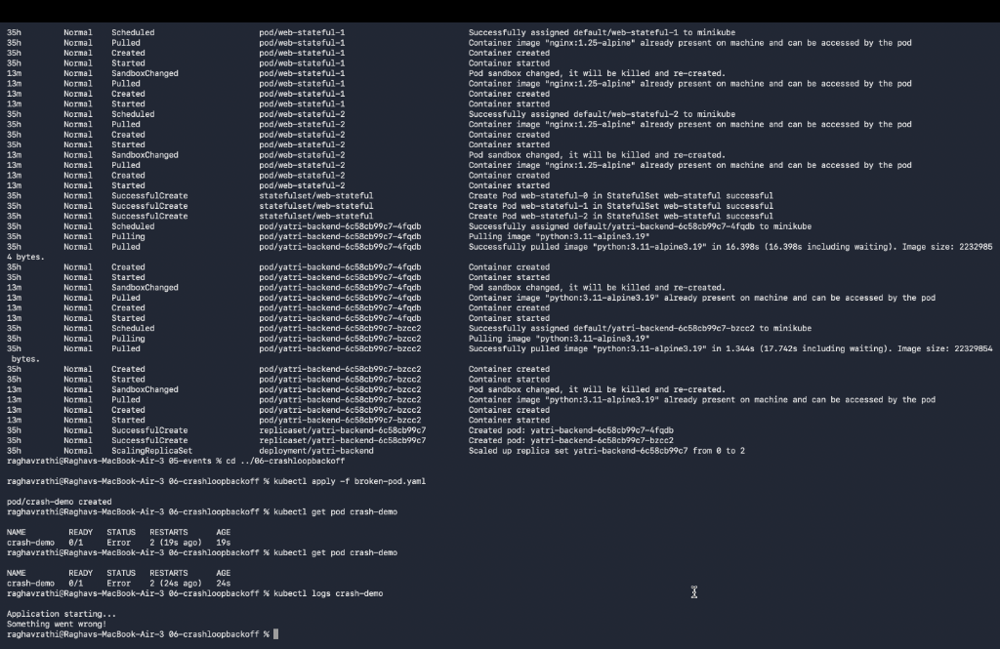
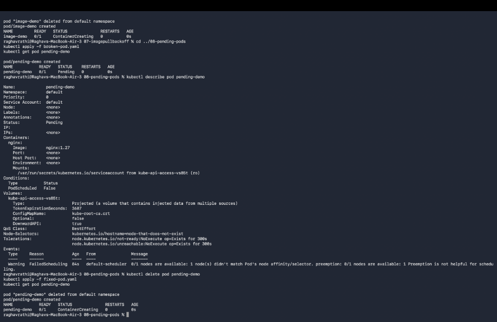
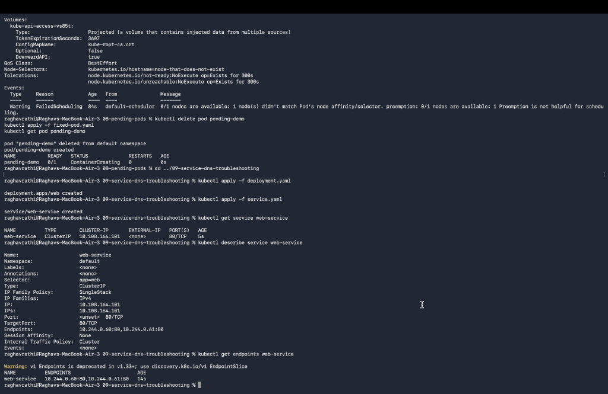
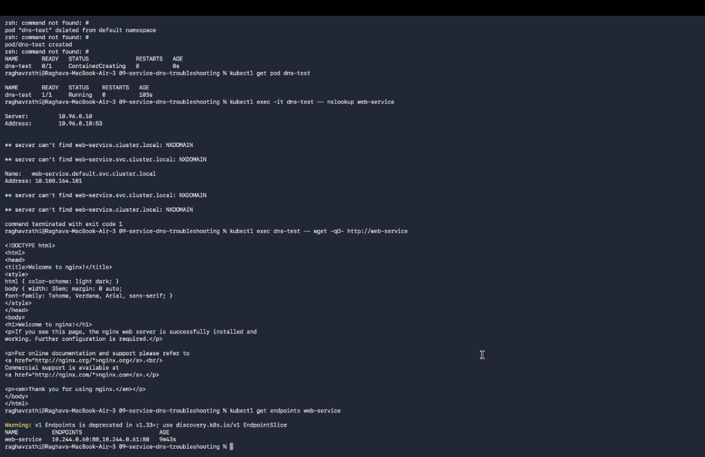

# Session 14: Kubernetes Troubleshooting & Debugging

## Overview
This directory contains the completed assignment submissions, diagnostic steps, terminal logs, and verified screenshots for **Session 14: Kubernetes Troubleshooting & Debugging**.

---

## 1. `kubectl get` — Pods & Wide Inspection
Inspecting cluster state, pod readiness, restart counts, and IP address / node allocations using `kubectl get pods -o wide`.

---

## 2. `kubectl describe` & `kubectl logs`
Deep-dive inspection of pod metadata, conditions, scheduling events, stdout logs, and stream tailing.

---

## 3. `kubectl exec` & Kubernetes Cluster Events
Container shell access, remote execution, and monitoring cluster-wide event streams via `kubectl get events`.

---

## 4. Debugging `CrashLoopBackOff`
Diagnosing application exit codes, crash loops, and verifying fixed pod startup logs.

---

## 5. Resolving `ImagePullBackOff` & `ErrImagePull`
Identifying invalid image tags/registries and inspecting image pull failure events.

---

## 6. Troubleshooting `Pending` Pods & Node Selectors
Investigating unschedulable pods caused by unmatched node selectors or affinity rules.

---

## 7. Service Endpoints, CoreDNS & HTTP Connectivity
Validating Service endpoint mappings, CoreDNS internal resolution via `nslookup`, and HTTP `wget` verification.

