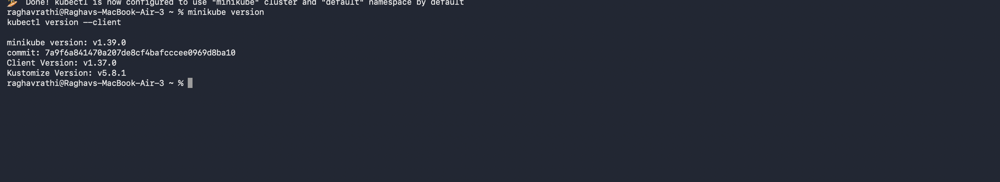
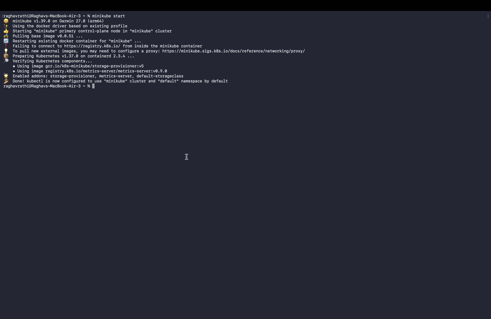
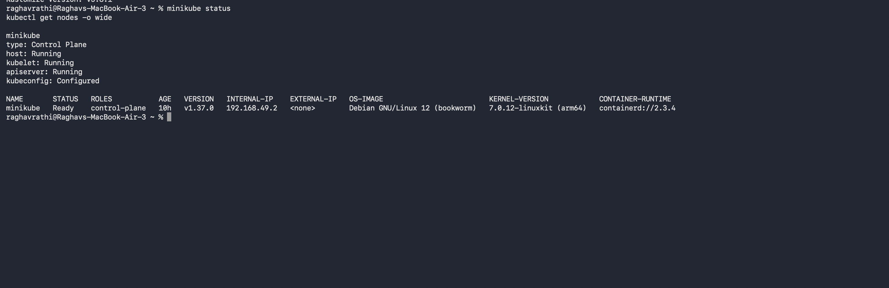
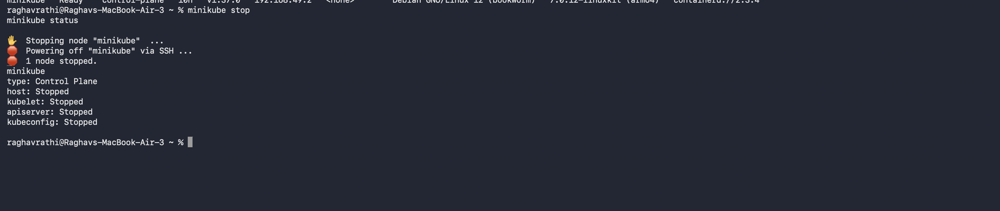

# Session - 9: Kubernetes Fundamentals & Minikube Installation

## Minikube & CLI Installation

---

## Starting Minikube Kubernetes Cluster

---

## Cluster Status

---

## Stopping Minikube

---

## Kubernetes Cluster Architecture & Component Analysis

Kubernetes is made up of a **control plane**, which manages the cluster, and **worker nodes**, which run applications.

### Control Plane

- **kube-apiserver**: The main entry point to the cluster. `kubectl`, users, and other Kubernetes components communicate through its API.
- **etcd**: A consistent key-value store that keeps the cluster's configuration, desired state, secrets, and metadata. The API server is the only component that normally talks to `etcd` directly.
- **kube-scheduler**: Finds Pods that have not been assigned to a node and selects a suitable worker based on resources, affinity rules, taints, and tolerations.
- **kube-controller-manager**: Runs controllers that continuously compare the desired state with the current state and make corrections. For example, it keeps the requested number of Pod replicas running and reacts when a node fails.

### Worker Nodes

- **kubelet**: The agent on each node. It receives Pod instructions from the API server, starts containers through the runtime, checks their health, and reports their status.
- **kube-proxy**: Maintains network rules that let Services send traffic to the correct Pods across the cluster.
- **Container runtime**: Runs the containers through the Container Runtime Interface (CRI). Common runtimes include `containerd` and `CRI-O`.
- **Pod**: Kubernetes' smallest deployable unit. A Pod contains one or more related containers that share networking and storage. Most Pods contain one main application container, sometimes with helper or init containers.

In simple terms, the control plane decides **what should run and where**, while worker nodes provide the resources to **run and connect those applications**. Kubernetes continually reconciles the two so the actual cluster matches the desired configuration.
